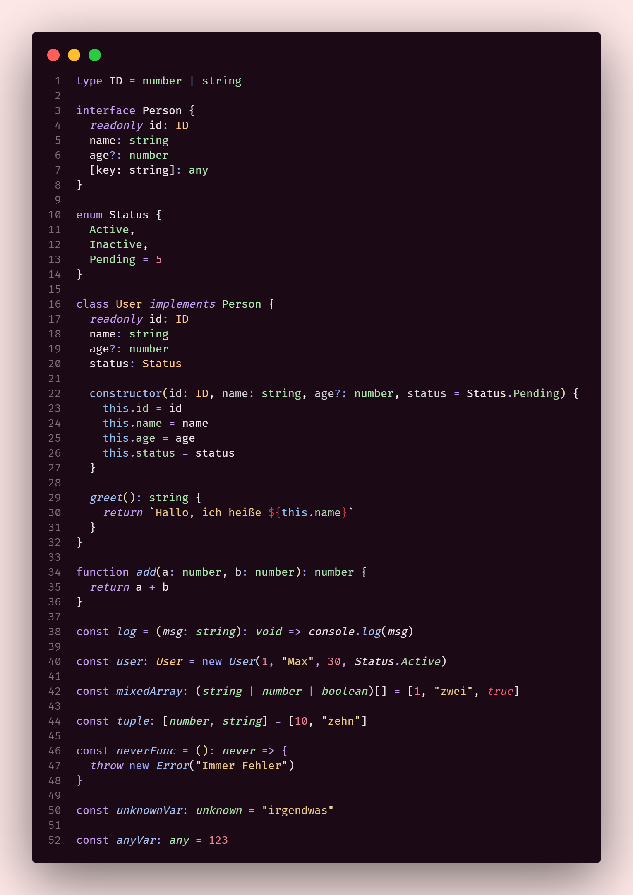

# Chronica

Chronica is a minimal, clean theme designed for developers who prefer a calm and focused interface. The current release includes Chronica Pink, a soft pink color scheme with subtle contrasts, ideal for reducing visual fatigue while keeping things aesthetically sharp.

More color variants are planned and will be added under the same project as they’re ready.

## Features

- Clean, distraction-free design
- Pleasant color palette optimized for long coding sessions
- Easy on the eyes, especially in low-light environments
- Built with consistency and attention to detail

## Available variants

- **Chronica Pink** - Built with consistency and attention to detail

*More variants coming soon*

## Feedback & Contributions

Ideas, suggestions, and improvements are welcome. If you have a color variant in mind that fits the Chronica aesthetic, feel free to reach out or open a pull request.
